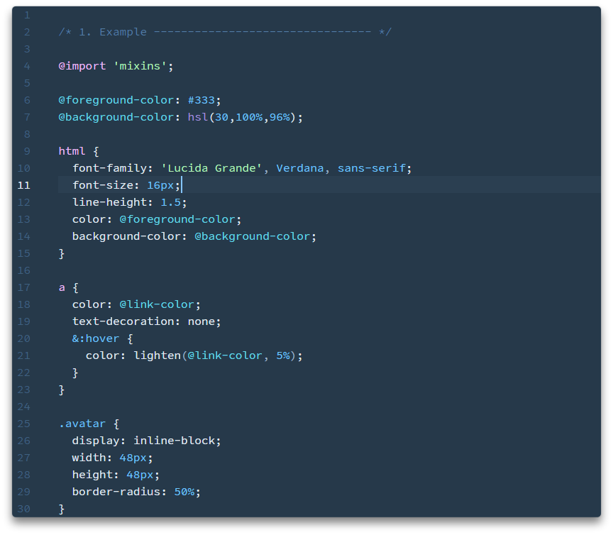

# Install

From the command line:

`apm install rain-syntax`

If the command line isn't your thing:

- Go to **Settings > Install**
- Search for `rain-syntax` and click **Install**
- Go to **Settings > Themes** and choose **Rain** from the dropdown menu
- Happy coding! :heart:
